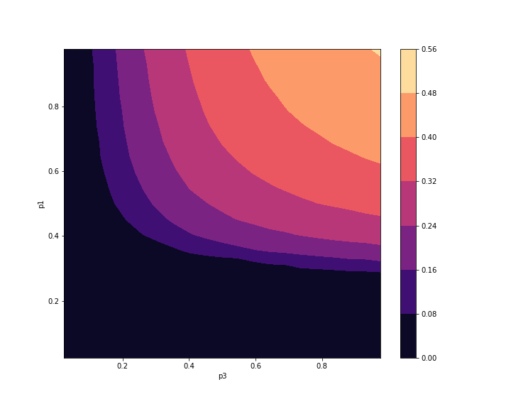

# SIRS Model - Coursework 2 Part 2 (2021 - 2022)

### **Course Name**: Modelling and Visualisation in Physics

### **Coursework Name**: SIRS Model
### **Objectives**:
* For the **SIRS model without immunity**, compute **contour plots** (heatmapts) of the **average infected fraction** and of the **scaled variance of infected sites versus p1 and p3**, for p2 = 0.5 (where p1, p2, p3 are probabilities discussed in a later section). For the resolution of the heatmap, p1 and p3 should change in steps of 0.05 or lower. Moreover, obtain plot of the **variance of infected sites** versus p1 for p2 = p3 = 0.5, with error bars.
* For the **SIRS model with immunity**, obtain a curve showing the **average infected fraction of sites as a function of the immune fraction $f_{\text{Im}}$**, showing **error bars**, for the specified parameter set.

### **Programming Language**:  Python3
### **Final Mark**: 15 / 15


## Files
  * **[CellularAutomataDocument.pdf](CellularAutomataDocument.pdf)** --> This pdf file contains the description of the Game of Life and the SIRS Model.
  * **[results](results)** --> Directory which contains the data files for all the experiments I ran.
  * **[src](src)** --> This directory contains the code for the project, and a Jupyter notebook, test.ipynb, in which I plotted the different contour plots (for the mean and variance of infected sites with p2=0.5), the variance of infected sites versus p1 (with $p_2 = p_2 = 0.5$), and the avg infected fraction versus the immunity fraction.
  * **[img](img)** --> This directory includes plots which used the data from results. More information about these plots in the README below and in the .pdf document.

## Brief description of the SIRS Model
The SIRS model is another example of cellular automaton, which is a model of **epidemics spreading**.
The SIRS comprises cells, or agents (i.e., people or other organisms) arranged on a two-dimensional lattice. The agents may contract some infection, and can be in one of three states:

* **S**: susceptible to the infection;
* **I**: infected;
* **R**: recovered from the infection (and hence immune to it).

The SIRS model is called like this because agents go through these states cyclitodcally: S changes to I when a susceptible agent comes into contact with an infected one; recovery changes the agent from I to R; eventually, in the absence of contact with infected agents, the immune response wears o  and R changes back to S.

We will consider in the a stochastic, rather than deterministic, version of this cellular automaton. The rules according to which the dynamics of the SIRS models unfolds are the following:
* A susceptible cell/agent S becomes infected (I) with probability p1, if at least one nearest neighbour of i is I (SIRS uses the four nearest neighbours, as in the Ising model, and unlike the 8 nn in the Game Of Life); otherwise the cell/agent remains susceptible.
* An infected site (I) becomes recovered (R) with probability p2.
* A recovered site (R) becomes susceptible (S) again with probability p3.

Note that the dynamics becomes deterministic if p1 = p2 = p3 = 1

## Getting Started

These subsections will help you get a copy of the project and understand how to run it on your local machine for development and testing purposes.
I will discuss how to clone this repository and set it up in any IDE of your choice. Furthermore, instructions on how to run the server will be given as well as how to run the project from the terminal.

### How to Install

The first thing you should do is clone this repository into your local machine. You can do this with the following command:
```
git clone https://github.com/Paramiru/SIRS-Model
```
Once you have cloned the repository, you should check your current version of Python. I used Python3 for the project. You can check the version you are currently using running this command in the terminal.
```
python --version
```
In order to run the project with the same version I am using you can import the conda environment with the environment.yml file provided by running in your terminal:
```
conda env create -f environment.yml
```
This will create an environment named *SIRS-Model* which you can use for running the code without having to install the dependencies on your system. Read [this article](https://realpython.com/python-virtual-environments-a-primer/) to understand the reasons for why virtual environments are important in Python.

## Running the Project 

Once you have cloned the repository and have the conda environment (or another virtual environment with the required dependencies) you can then run the **experiments.py** and change the `main()` function to observe the animation of the different systems, or to obtain data. The different possibilities are:

* `exp1()`: Method to animate the normal SIRS Model with a different choice of p1 (probability of S cell becoming I), p2 (prob of I becoming R), and p3 (prob of R becoming S). You can uncomment a different choice of probabilities to observe three different behaviours:
  * An **absorbing state** where all the cells end up being in the same state.
  * A **dynamical equilibrium** where we do not find any dominant behaviour.
  * **Cyclic waves** where we find waves of infected cells from time to time.

* `exp2()` gets the data needed to show the scaled variance with error bars.

* `exp3()` gets the data to show the average infected fraction of sites as a function of the immune fraction $f_{\text{Im}}$.

* `exp4()` animated a SIRS model with a given fraction of immune sites.

## Results obtained from the SIRS-Model
To reproduce these results you can run the different experiments from **experiments.py** with different arguments. All the results can be found in src/test.ipynb.

Note: all these measurements were taken for a 50 x 50 square lattice.
Note2: the systems from which these results were obtained can be visualised by going to `src/experiments.py` and call the method `.animate()` from a `SIRS_Model` or `SIRS_Model_Immune` object. 

### Phase Transition
The SIRS model shows a phase transition between a state with no infection
(the absorbing state, where all agents are susceptible in steady state), to another
one where a  nite fraction of the lattice is infected in steady state. This is an
example of a nonequilibrium phase transition with an absorbing phase { as
discussed previously no system in thermal equilibrium can ever display such a
transition.

A useful way to characterise thermodynamic phase transition is via an order parameter. In the SIRS model, a natural choice is the fraction of infected (I) sites. I obtained two contour plots and a normal plot from which we can distinguish the phase transition.

#### **1. Average Number of Infected Sites**

First, I show the **average number of infected sites** with $p_1$ and $p_3$ in the axes, for a value of $p_2=0.5$.

<br>
<p align="left">
  
  <br>
</p>

#### **2. Scaled Variance of Infected Sites**

For the second figure, I show the **scaled variance of infected sites** versus $p_1$ and $p_3$, with $p_2 = 0.5$ as before.
<p align="right">
  
  <br>
</p>

#### **3. Variance of Infected Sites**

Lastly, I plot the **variance of infected sites** versus $p_1$, where $p_2$ and $p_3$ have been set to $0.5$.
<p align="center">
  
  <br>
</p>

<hr>

### SIRS model with immunity
The last experiment shown deals with adding immune cells to the system. Here I show a plot to understand how high the fraction of immune cells has to be for the average infected fraction become zero. We see that with a value of around $f_{\text{Im}} \approx 0.3$ the system does not exhibit infected cells.

<p align="center">
  
  <br>
</p>

<hr>

## Built With

* [Python3](https://www.python.org/downloads/)
* [Conda](https://docs.conda.io/en/latest/) - Dependency Management for Python

## Python Dependencies

* [Numpy](https://numpy.org/doc/stable/index.html)
* [Matplotlib](https://matplotlib.org/stable/)

## Authors

* **Pablo Miró** - [Paramiru](https://github.com/Paramiru)

